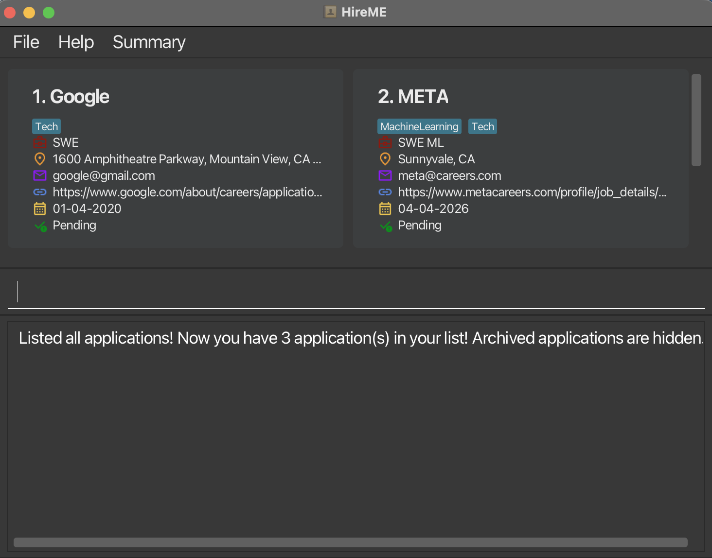

# HireME

HireME is a desktop application designed for Computer Science students to manage internship applications and related interview information.

---

## Product Information

**Product Name:** HireME  
**Target User:** CS Student

**Value Proposition:**  
Provide a convenient way to keep track of internship applications and current status. Allow easy access to company information and contact details.

---

  Example usages:
  * as a record of ongoing job application status
  * as a record of important company information

The project simulates an ongoing software project for a desktop application (called _HireME_) used for managing job application details.
  * It is **written in OOP fashion**. It provides a **reasonably well-written** code base **bigger** (around 2 KLoC) than what students usually write in beginner-level SE modules, without being overwhelmingly big.
  * It comes with a **reasonable level of user and developer documentation**.

For the detailed documentation of this project, see the **[HireME Product Website](https://ay2526s2-cs2103t-w11-3.github.io/tp/)**.

This project is a **part of the se-education.org** initiative. If you would like to contribute code to this project, see [se-education.org](https://se-education.org/#contributing-to-se-edu) for more info.

This project is based on the AddressBook-Level3 project created by the [SE-EDU initiative](https://se-education.org).
