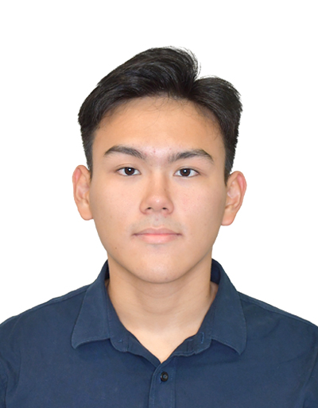
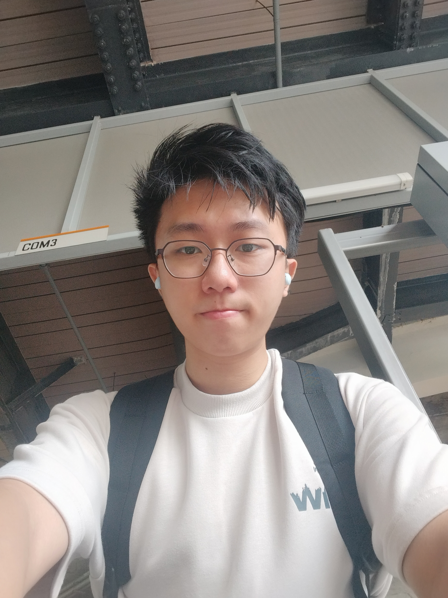
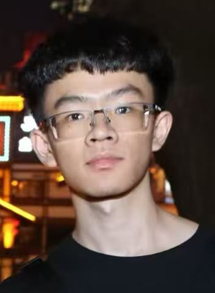
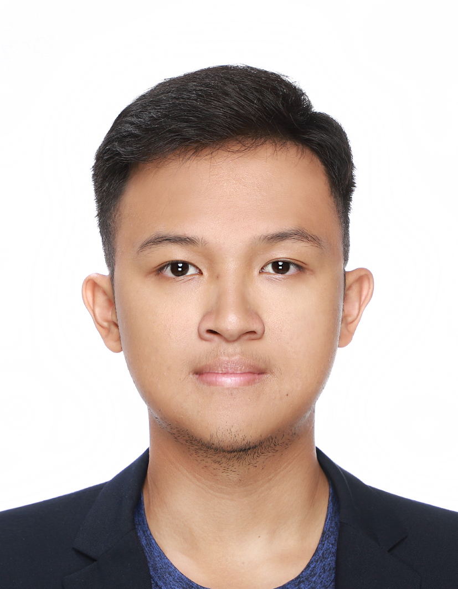

We are a team based in the [School of Computing, National University of Singapore](https://www.comp.nus.edu.sg).

You can reach us at the email `seer[at]comp.nus.edu.sg`

## Project team

### Yong Kin Yean (Kingsley)

[[github](http://github.com/kinyean)]

* Role: Grunt
* Responsibilities: A little bit of everything

### Guo Keming

[[github](https://github.com/Kemango)]

* About me: Year 2 CS Student 
* Hobby: Running, Photography
* Role: Code quality
* Responsibilities: Looks after code quality, ensures adherence to coding standards, etc.

### Nuowen Qian

[[github](http://github.com/NuowenQ)]

* Role: Developer
* Responsibilities: Dev Ops + Threading

### LOH WAI KIT (Jamie)

[[github](http://github.com/jamieloh)] 

* Role: Developer
* Responsibilities: A little bit of everything

### Leomarbel (Daryl Teoh)

[[github](http://github.com/leomarbel)]

* Role: Developer
* Responsibilities: A little bit of everything
